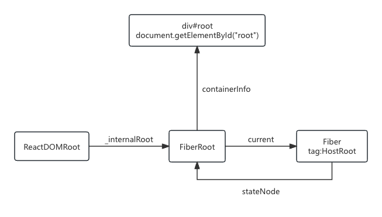

## TINY-REACT

1. `pnpm i`
2. `pnpm run test`

## DEBUG FROM SOURCE CODE

1. ENTER `examples` folder
2. RUN `npm i`
3. RUN `npm run dev`

## Under the hood
1. `ReactDOM.createRoot(document.getElementById("root") as HTMLElement)`

```javascript
ReactDOM.createRoot(document.getElementById("root") as HTMLElement) -> ReactDOMRoot

ReactDOMRoot:
  _internalRoot: FiberRoot = createFiberRoot(document.getElementById("root"))
  
  FiberRoot:
    containerInfo =  document.getElementById("root")
    current: Fiber = createFiber(HostRoot, null, null)
      current.stateNode = _internalRoot
    finishedWork = null
```

